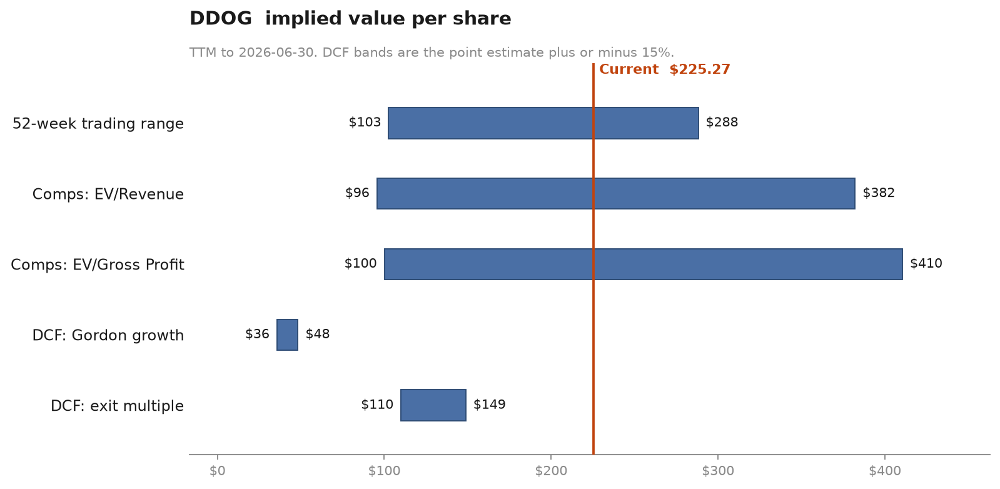

# techval



An open-source valuation engine that produces analyst-grade DCF, trading comps
and merger analysis for US-listed technology companies, using only free data:
SEC EDGAR company facts for fundamentals, Nasdaq's public quote API for prices,
and the US Treasury daily curve for the risk-free rate. Every number it prints
traces back to a filing, a quote, or an assumption you wrote down. When a figure
cannot be sourced it raises an error naming the XBRL concept and the tags it
tried, rather than interpolating something plausible.

---

## Sample output

```
$ techval value DDOG --config assumptions.yaml

────────── Datadog, Inc. (DDOG)  normalized TTM, USD millions ──────────
CIK 1561550   twelve months ended 2026-06-30

Revenue                   3,966.7
Gross profit              3,154.0  79.5% of revenue
EBIT                         16.3   0.4% of revenue
D&A                          62.0
EBITDA                       78.3   2.0% of revenue
Stock-based compensation    823.0  20.7% of revenue
Net income                  177.5
Diluted shares (mm)         366.9

──────────────────── Enterprise value bridge ────────────────────
Share price                     225.3
Equity value                 82,659.3
+ Straight debt                   0.0
+ Convertible notes               0.0
+ Operating leases                0.0
- Cash and equivalents        (435.0)
- Short-term investments    (4,550.5)
Enterprise value             77,673.9

Convention: operating leases excluded, EBITDA basis (ASC 842).
Notes
  - Convertible notes of 986mm are in the money at 225.27 against a
    148.15 conversion price. Under ASU 2020-06 their shares are already
    in diluted WASO, so they are carried as equity, not debt.

──────────────────────── WACC buildup ────────────────────────
Input                    Value  Source
Risk-free rate           4.83%  US Treasury 10Y constant maturity, 2026-09-09
Equity risk premium      5.00%  assumption: market.equity_risk_premium
Levered beta             1.421  median of 6 peer unlevered betas, relevered
Pre-tax cost of debt    11.27%  synthetic: EBIT/interest of 1.4x maps to B3/B-
Weight of equity          1.00  E / (D + E) on 82,659mm
Cost of equity          11.93%  CAPM: risk-free + beta x ERP + size premium
WACC                    11.93%  100.0% x 11.93% + 0.0% x 8.57%

Notes
  - DDOG is net cash by 4,985mm. Weights still use gross debt, because the
    tax shield attaches to debt outstanding and not to a net position.

────────────────────── Discounted cash flow ──────────────────────
  Implied per share, Gordon growth   $41.98
  Implied per share, exit multiple  $129.40

Cross-checks
  - The Gordon terminal value implies an exit multiple of 7.3x terminal
    EBITDA of 1,906mm. The peer median today is 37.3x, a gap of -80%.
  - The 37.3x exit multiple implies perpetuity growth of 9.84% against a
    WACC of 11.93%.
  - FLAG: Gordon terminal value is 81% of enterprise value, above the 75%
    mark. The valuation is a bet on the terminal assumption, not on the
    forecast.
  - FLAG: Terminal reinvestment is 44mm on 1,328mm of NOPAT, a reinvestment
    rate of 3.3%. It implies a terminal ROIC of 75.2%, above the 60% mark.
    A perpetual return that far above the cost of capital assumes no
    competitor ever arrives.
```

The Datadog run is worth reading as a result, not just as a demo. On GAAP
economics with stock compensation expensed, the DCF lands far below the market
price, the implied exit multiple from the perpetuity is a fifth of what the peer
set trades at, and four fifths of the value sits in the terminal assumption. The
engine says all of that on screen rather than printing a single number. Flipping
`sbc_treatment` to `addback` roughly triples the DCF, which is the honest measure
of how much that one accounting judgment is carrying.

---

## The judgment calls

Four decisions move the answer more than anything else in the code.
`docs/methodology.md` argues each one at length; this is the summary.

**Stock-based compensation is expensed, not added back.** GAAP EBIT is already
net of SBC, so the default adds nothing back and free cash flow is struck after
the full cost of paying employees. The opposing camp adds it back as non-cash;
that is defensible only alongside a growing share count, because adding back the
benefit while ignoring the dilution counts one side of the transaction. For
Datadog the switch is worth about $823mm a year, 21% of revenue.

**Operating leases are excluded from debt, and EBITDA is the pairing.** Under
ASC 842 the lease charge stays inside operating income as straight-line rent. It
is not split into depreciation and interest the way IFRS 16 requires, so US-GAAP
EBITDA is already *after* rent. Adding the liability to debt while dividing by
that EBITDA charges the lease twice. Set `capitalize_operating_leases: true` and
every multiple switches to EBITDAR automatically; the engine will not let the two
conventions mix. Finance leases are debt either way.

**In-the-money convertibles are equity, not debt.** ASU 2020-06 made if-converted
mandatory, so a dilutive convertible's shares are already inside diluted
weighted-average shares. Counting the principal as debt on top of that
double-counts the instrument, by $986mm in Datadog's case.

**Beta is the median of peer asset betas, relevered.** Each peer's levered beta
is unlevered at its own D/E and tax rate, the median of those is taken, and the
result is relevered at the target's capital structure, so what gets pooled is
business risk rather than financing policy. Regressions are joined on the dates
the two series actually share, never zipped by position, and R-squared and the
standard error are printed because a beta of 1.42 on an R-squared of 0.11 is not
something the market told you with confidence.

**Mid-year discounting, with one asymmetry.** Explicit flows discount at
`(1+w)^-(t-0.5)`. The Gordon terminal value carries the same half-year uplift,
because its perpetuity flows also arrive mid-year. The exit-multiple terminal
value does **not**: a multiple is a price struck at a date, so it discounts over
whole periods. Applying the mid-year factor to both overstates the exit-multiple
case by roughly half a year of WACC.

---

## Install

Requires Python 3.11+ and [uv](https://docs.astral.sh/uv/).

```bash
git clone <this repo> && cd techval
uv venv && uv pip install -e ".[dev]"
export TECHVAL_SEC_EMAIL=you@example.com   # SEC fair access requires a contact
cp assumptions.example.yaml assumptions.yaml
```

The SEC blocks automated clients that do not declare a contact address, so the
engine refuses to start without `TECHVAL_SEC_EMAIL`.

## Usage

```bash
uv run techval value DDOG --config assumptions.yaml   # full valuation + chart
uv run techval comps DDOG --config assumptions.yaml   # comp table only
uv run techval merger CRWD MDB --config assumptions.yaml
uv run techval fetch DDOG                             # warm cache, show provenance
```

`--no-cache` bypasses the HTTP cache. Everything else is in
`assumptions.yaml`: no rate, growth path, margin or multiple is hardcoded
anywhere in the engine.

Programmatic use returns dataclasses and DataFrames, with rendering confined to
the CLI:

```python
from techval.financials import build_financials
from techval.ev_bridge import build_ev_bridge
from techval.config import Assumptions

fin = build_financials("DDOG")
bridge = build_ev_bridge(fin, 225.27, Assumptions.load("assumptions.yaml"))
print(bridge.enterprise_value, bridge.multiple_denominator(fin))
```

---

## What the data layer handles that a naive one does not

Turning `companyfacts` into an income statement is most of the work, and these
are all observed in the four filings committed as test fixtures:

- **Retired tags.** A tag that ever appeared stays in the payload forever with a
  stale value. Balance-sheet concepts therefore resolve *as of a date*, and a
  tag whose newest fact is more than 20 days old is skipped. Zscaler reports
  marketable securities under `DebtSecuritiesAvailableForSaleExcludingAccruedInterestCurrent`;
  resolving by first-tag-present returned zero and overstated its EV by $2.5bn.
- **Quarters that were never filed.** Q4 is always the year less nine months.
  Snowflake tags D&A only cumulatively; CrowdStrike files a year-to-date half
  plus a discrete Q2 with no discrete Q1. Periods are recovered by subtracting
  nested windows that share an endpoint, then tiled to twelve months exactly.
- **Stock splits.** CrowdStrike's four-for-one in mid-2026 leaves pre-split share
  counts in periods no later filing restates. Mixing them gave a TTM diluted
  count of 271mm against a true 1,023mm. Splits are detected from the filings
  themselves and earlier facts restated into current units.
- **Averages that are not sums.** Weighted-average share counts are aggregated as
  integrals (average times days) so they can be added and subtracted at all.
- **Dimensioned facts are absent.** `companyfacts` publishes only undimensioned
  facts, so a dual-class issuer has no `dei:EntityCommonStockSharesOutstanding`
  at all. Datadog is one, which is why diluted WASO is used throughout.

Every line item carries provenance: the tag that won, the periods used, the forms
they came from and the method. `techval fetch <TICKER>` prints the table.

---

## Limitations

Read these before quoting a number from this tool.

- **Diluted WASO approximates the share count.** A full treasury-stock-method
  count on currently outstanding in-the-money awards would be more precise for a
  point-in-time equity value, but the strike detail lives in dimensioned XBRL
  that `companyfacts` does not publish. WASO is backward-looking, so it
  understates the count for a company issuing steadily.
- **Book value proxies the market value of debt**, in the EV bridge and in the
  WACC weights. Close for investment-grade paper near par, wrong for distressed.
- **Cost of debt is synthetic.** Interest coverage maps to a rating and a spread.
  Coverage is the wrong risk metric for a net-cash issuer: Datadog's 1.4x
  coverage implies a speculative rating against negligible actual default risk.
  The debt weight is near zero there, so it barely reaches the WACC, but for a
  company with real debt and real cash you should override the rate.
- **No purchase accounting.** The merger module models no opening balance sheet,
  no goodwill, no deferred tax on the step-up, no deferred revenue haircut and no
  debt paydown. Year-one EPS on two sets of TTM figures is a screening tool, not
  a merger model.
- **No NOL tracking.** A projected loss year books no tax benefit and creates no
  carryforward the model later uses, which understates value for a company with
  large accumulated losses.
- **US GAAP only.** No foreign private issuers, no IFRS, no 20-F filers.
- **The equity risk premium is an assumption**, not a measurement, and it is the
  largest single unobservable in the output.
- **Peer sets are hand-picked** in YAML. There is no automated screen, and
  comparability is your judgment.

---

## Tests

```bash
uv run pytest
```

No test touches the network. Fixtures are frozen SEC `companyfacts` payloads and
Nasdaq daily closes retrieved 2026-09-10, pruned to the concepts the engine reads
and to facts from 2023 onward. The four companies are chosen for what they break:
Datadog for in-the-money convertibles and thin GAAP EBITDA, CrowdStrike for a
January year end plus a four-for-one split and no combined D&A tag, MongoDB for
finance leases, Zscaler for a retired-tag balance.

The accretion/dilution test checks against a worked example whose arithmetic is
written out in the test docstring, and separately asserts that substituting the
solved breakeven synergy figure returns pro forma EPS to standalone.

---

## Data sources and SEC fair access

- **Fundamentals**: `data.sec.gov/api/xbrl/companyfacts`. Requests declare a
  contact in the `User-Agent` as the SEC requires, are throttled to 8 per second
  against a published limit of 10, and back off exponentially on 429 and 503.
- **Prices**: Nasdaq's public quote API. No key, no account.
- **Risk-free rate**: US Treasury daily yield curve, 10-year constant maturity.

The package originally targeted Stooq for prices. Stooq now answers plain HTTP
clients with a JavaScript proof-of-work challenge instead of CSV. Defeating a bot
check the operator deliberately erected is not something this package will do, so
the Stooq source raises an explanatory error and points at the alternatives.
Sources sit behind one interface, and a local CSV source makes a valuation
reproducible offline years later.

All HTTP responses are cached by request URL under `~/.techval/cache`, so the
same ticker and the same assumptions produce identical output on every run.

## Licence

MIT.
